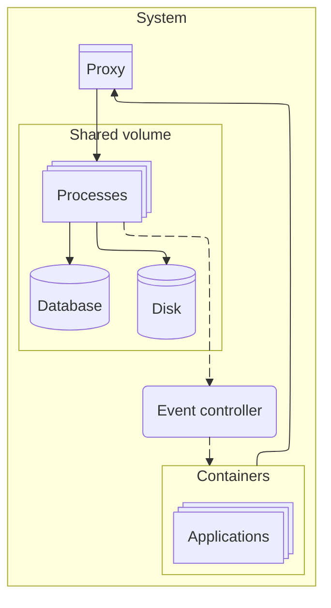
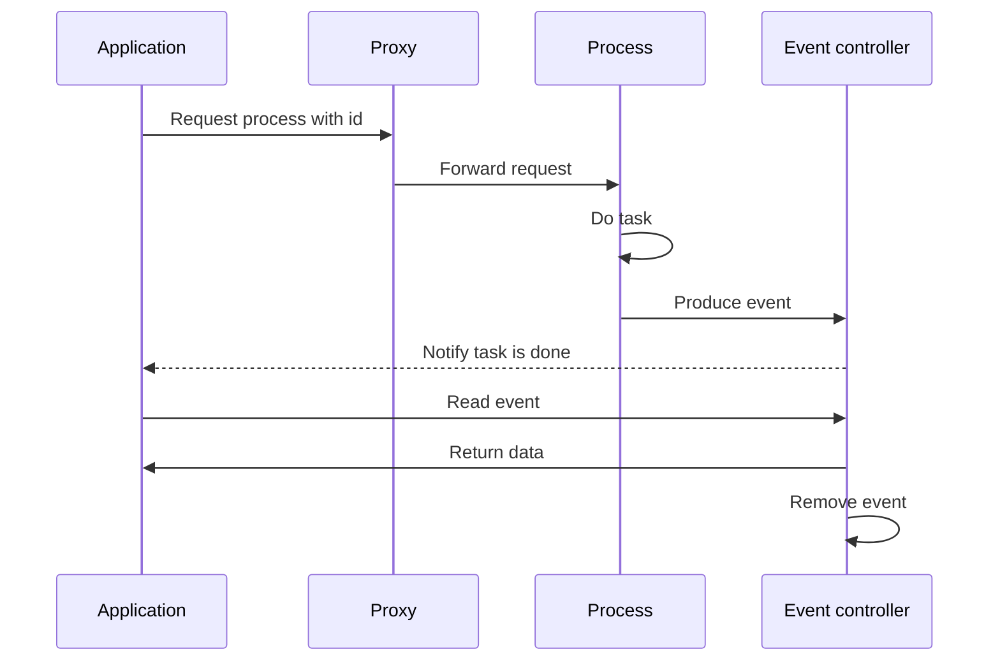

# docker-ipc

Testing out IPC between docker containers

```mermaid
---
config:
  flowchart:
    defaultRenderer: "elk"
---
flowchart
  subgraph sys[System]
    direction TB
    subgraph containers[Containers]
      apps@{ shape: processes, label: "Applications" }
    end
    proxy@{ shape: div-rect, label: "Proxy" }
    event@{ shape: rounded, label: "Event controller" }
    containers --> proxy --> processes
    subgraph volume["Shared volume"]
      direction TB
      processes@{ shape: processes, label: "Processes" }
      disk@{ shape: lin-cyl, label: "Disk" }
      db@{ shape: cyl, label: "Database" }
      processes --> disk & db
    end
    processes e1@--> event e2@--> containers
    e1@{ animate: true }
    e2@{ animate: true }
  end
```

```mermaid
sequenceDiagram
Application->>Proxy: Request process with id
Proxy->>Process: Forward request
Process->>Process: Do task
Process->>Event controller: Produce event
Event controller-->>Application: Notify task is done
Application->>Event controller: Read event
Event controller->>Application: Return data
Event controller->>Event controller: Remove event
```
